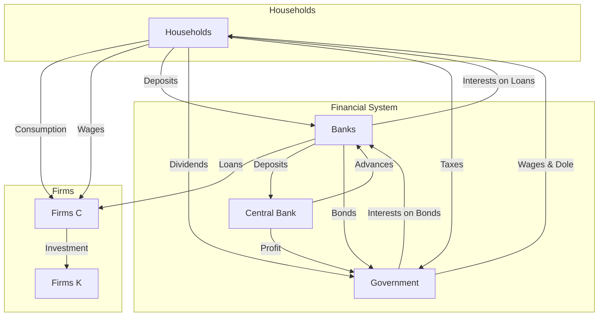

# AB-SFC
Agent Based Stock Flow Consistent Macroeconomic Model 

```mermaid
graph TD
    subgraph Firms
        K["Firms K"]
        C["Firms C"]
    end

    subgraph Households
        H["Households"]
    end

    subgraph Financial System
        B["Banks"]
        CB["Central Bank"]
        G["Government"]
    end

    %% Relationships
    H -->|Consumption| C
    C -->|Investment| K
    H -->|Wages| C
    H -->|Deposits| B
    B -->|Loans| C
    B -->|Interests on Loans| H
    B -->|Deposits| CB
    B -->|Bonds| G
    G -->|Interests on Bonds| B
    CB -->|Advances| B
    CB -->|Profit| G
    H -->|Dividends| G
    H -->|Taxes| G
    G -->|Wages & Dole| H
```